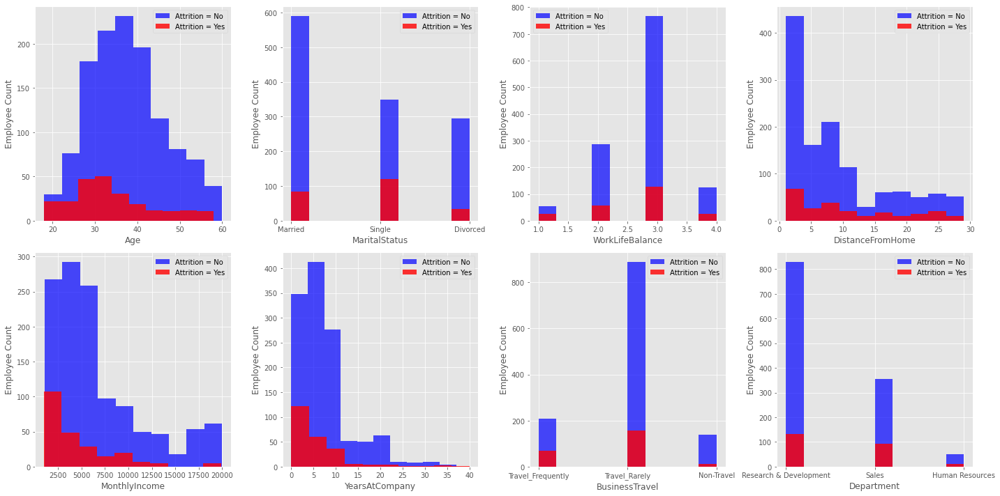

# Predicting Voluntary Employee Attrition 

### Background and Objectives

From my experience as an entrepreneur, it is critical to manage voluntary employee attrition ensuring your business remains profitable and maintains a high level of efficiency. According to Work Institute's 2017 Retention Report, it is estimated to cost as much as 33% of a worker's annual salary to replace an employee. Additionally, the report found that about 75% of the reasons employees leave could have been prevented. So, to help businesses save money and time trying to find replacements, I want to gain more insight as to what the key contributing factors are when an employee leaves a company voluntarily.

In order to analyze these factors I am going to analyze the ‘IBM HR Analytics Employee Attrition Dataset’ (ADD KAGGLE LINK) dataset and build various machine learning algorithms to predict which employees left voluntarily and why. Also, I want determine which factors have the most correlation to an employee leaving voluntairy so HR departments can better understand which employees may be at more risk of leaving. After performing this analysis, I will make some recommendations to HR Departments on actions they can take to help minimize their employee attrition rate and retain their talent better. 

USE PHRASE "RETAIN TALENT"

Source: https://www.hrdive.com/news/study-turnover-costs-employers-15000-per-worker/449142/
Source: https://www.benefitnews.com/news/avoidable-turnover-costing-employers-big?brief=00000152-14a7-d1cc-a5fa-7cffccf00000&utm_content=socialflow&utm_campaign=ebnmagazine&utm_source=twitter&utm_medium=social

### Initial Questions and Assumptions

#### Business Questions to Answer
* What factors are contributing the most to employee attrition?
* Which department is suffering the most from employee attrition?
* How much does commuting time affect employee attrition?
* Approximately how much money can these models save a business?

#### Initial Employee Attrition Assumptions
* Working overtime will correlate strongly with employees leaving voluntarily
* Younger employees in general will be at higher risk of leaving voluntarily (<40)
* Low 'Job Satisfaction' and 'Work Life Balance' will cause employees to leave the company voluntariliy
* Employees that live far away from the office (long commute) are more susceptible to employee attrition

### Raw Data Review

After loading the dataset in to a Pandas DataFrame in Python, here is how the data looks and my main takeaways:

INSERT TABLE HERE

* Dataset includes a total of 1470 rows (i.e. Employees) and 35 columns (i.e. Features)
* There are several columns that include categorical values: BusinessTravel, Department, EducationField, JobRole, and Marital Status
* The Dataset does not include any 'null' or 'NaN' values
* There are some columns that can be dropped from the dataset as they do not provide any value: EmployeeCount, EmployeeNumber, StandardHours and Over18
* Two columns will need to be converted from "Yes" or "No" values to binary values: Attrition (our 'target') and OverTime

### Data Cleaning
* remove columns employee_count, employee_number, over18, standard_hours --- DONE
* remove hourly_rate, monthly_rate or daily_rate as they are directly correlated

### Exploratory Data Analysis

After the dataset was cleaned, I wanted to perform some Exploratory Data Analysis (EDA) on the features to confirm my initial assumptions and see if any other features had strong correlations to employee attrition. So, to start I started plotted a histogram of all the features to better understand the distributions of each column in the dataset. There were a few things that stuck out to me after generating the plot (INSERT PLOT HERE if you want to take a closer look):

* The vast majority of the company lives within 10 miles of the office.
* Job Satisfaction among the employees is high with most scores at a 3 or a 4 with a 4 being highest score.
* Majority of employees have worked at only 1 previous company before current position.
* **IMPORTANT**: The 'Attrition' target variable is highly imbalanced as only ~16% of employees left the company (~84% stayed with company). So, I will need to be sure to account for this imbalance while I am building my machine learning algorithms.

Additionally, after plotting each feature with respect to the 'Attrition' target variable, I found these 8 features had the most insight on if an employee voluntarily left the company.

### One-Hot Encoding / Elimination of Features?

* Categorical Features that require one-hot encoding: Business Travel, Department, Education Field, Job Role, Marital Status
* 

### Machine Learning Algorithms (INSERT HEADER FOR EACH ML ALGORITHM)

1) Logistic Regression: Want to minimize the Recall (TP/TP+FN) and so I used my findings from EDA to chose the Top 10 Features that I believe would best correlate to an employee leaving voluntarily (see list below):

assumed_top_10 = ['age', 'job_satisfaction', 'monthly_income', 'over_time', 'work_life_balance', 'years_since_last_promotion', 'marital_status_single', 'department_sales', 'num_companies_worked', 'job_involvement']

1) Random Forest

3) Decision Tree? Confusion Matrix (are we looking for Precision or Recall or what and why?)

5) LASSO Regression (L1) 

6) Feature Importance Graph

7) ROC / AUC Curve

### Conclusion and Recommendations

### Future Work
* Creating some sort of time series ML algorithm when the information changes over time
* Creating new features to train ML algorithms on (i.e. creating 'Young and Underpaid Feature')
