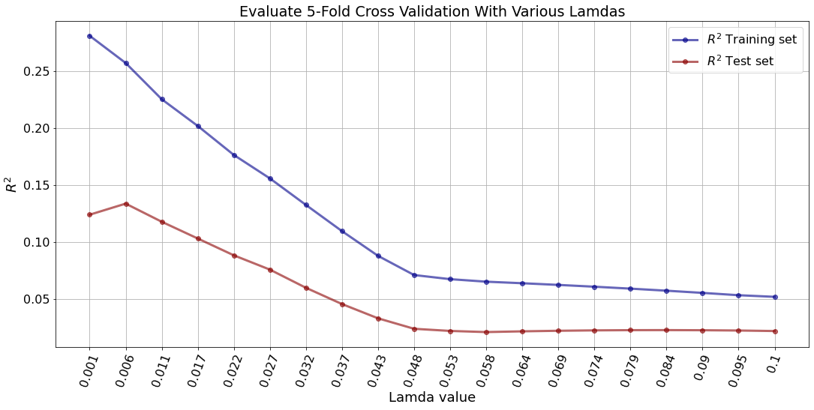

# 
Predicting and Inferring Voluntary Employee Attrition 

### Background and Objectives

From my experience as an entrepreneur, it is critical to manage voluntary employee attrition ensuring your business remains profitable and maintains a high level of efficiency. According to [Work Institute's 2017 Retention Report](https://www.hrdive.com/news/study-turnover-costs-employers-15000-per-worker/449142/), it is estimated to cost as much as 33% of a worker's annual salary to replace an employee. Additionally, the report found that about 75% of the reasons employees leave could have been prevented. On average in the United States, the percentage of employees leaving companies voluntarily is about 15% according to this [2020 Report from Mercer](https://www.imercer.com/articleinsights/North-American-Employee-Turnover-Trends-and-Effects). Ideally companies should aim to get their respective attrition rate under 10%. So, to help businesses save money and time trying to find replacements, I want to gain more insight as to what the key contributing factors are when an employee leaves a company voluntarily. 

In order to asses these factors I am going to analyze the [IBM HR Analytics Employee Attrition Dataset](https://www.kaggle.com/pavansubhasht/ibm-hr-analytics-attrition-dataset) dataset and build various machine learning models to predict which employees left voluntarily and why. Also, I want determine which factors have the most correlation to an employee leaving voluntairy so HR departments can better understand which employees may be at more risk of leaving. After performing this analysis, I will make some recommendations to HR Departments on actions they can take to help minimize their employee attrition rate and retain talent. 

### Initial Questions and Assumptions

#### Business Questions to Answer
* What factors are contributing the most to employee attrition?
* Which department is suffering the most from employee attrition?
* How much does commuting time affect employee attrition?
* What can HR staff do to help ensure they retain talent?

#### Initial Employee Attrition Assumptions
* Working overtime will correlate strongly with employees leaving voluntarily
* Younger employees in general will be at higher risk of leaving voluntarily (<40)
* Low 'Job Satisfaction' and 'Work Life Balance' will cause employees to leave the company voluntariliy
* Employees that live far away from the office (long commute) are more susceptible to employee attrition

### Raw Data Review

After loading the dataset in to a Pandas DataFrame in Python, here is how the data looks and my main takeaways:

|    |   Age | Attrition   | BusinessTravel    |   DailyRate | Department             |   DistanceFromHome |   Education | EducationField   |   EmployeeCount |   EmployeeNumber |   EnvironmentSatisfaction | Gender   |   HourlyRate |   JobInvolvement |   JobLevel | JobRole               |   JobSatisfaction | MaritalStatus   |   MonthlyIncome |   MonthlyRate |   NumCompaniesWorked | Over18   | OverTime   |   PercentSalaryHike |   PerformanceRating |   RelationshipSatisfaction |   StandardHours |   StockOptionLevel |   TotalWorkingYears |   TrainingTimesLastYear |   WorkLifeBalance |   YearsAtCompany |   YearsInCurrentRole |   YearsSinceLastPromotion |   YearsWithCurrManager |
|---:|------:|:------------|:------------------|------------:|:-----------------------|-------------------:|------------:|:-----------------|----------------:|-----------------:|--------------------------:|:---------|-------------:|-----------------:|-----------:|:----------------------|------------------:|:----------------|----------------:|--------------:|---------------------:|:---------|:-----------|--------------------:|--------------------:|---------------------------:|----------------:|-------------------:|--------------------:|------------------------:|------------------:|-----------------:|---------------------:|--------------------------:|-----------------------:|
|  0 |    41 | Yes         | Travel_Rarely     |        1102 | Sales                  |                  1 |           2 | Life Sciences    |               1 |                1 |                         2 | Female   |           94 |                3 |          2 | Sales Executive       |                 4 | Single          |            5993 |         19479 |                    8 | Y        | Yes        |                  11 |                   3 |                          1 |              80 |                  0 |                   8 |                       0 |                 1 |                6 |                    4 |                         0 |                      5 |
|  1 |    49 | No          | Travel_Frequently |         279 | Research & Development |                  8 |           1 | Life Sciences    |               1 |                2 |                         3 | Male     |           61 |                2 |          2 | Research Scientist    |                 2 | Married         |            5130 |         24907 |                    1 | Y        | No         |                  23 |                   4 |                          4 |              80 |                  1 |                  10 |                       3 |                 3 |               10 |                    7 |                         1 |                      7 |
|  2 |    37 | Yes         | Travel_Rarely     |        1373 | Research & Development |                  2 |           2 | Other            |               1 |                4 |                         4 | Male     |           92 |                2 |          1 | Laboratory Technician |                 3 | Single          |            2090 |          2396 |                    6 | Y        | Yes        |                  15 |                   3 |                          2 |              80 |                  0 |                   7 |                       3 |                 3 |                0 |                    0 |                         0 |                      0 |
|  3 |    33 | No          | Travel_Frequently |        1392 | Research & Development |                  3 |           4 | Life Sciences    |               1 |                5 |                         4 | Female   |           56 |                3 |          1 | Research Scientist    |                 3 | Married         |            2909 |         23159 |                    1 | Y        | Yes        |                  11 |                   3 |                          3 |              80 |                  0 |                   8 |                       3 |                 3 |                8 |                    7 |                         3 |                      0 |
|  4 |    27 | No          | Travel_Rarely     |         591 | Research & Development |                  2 |           1 | Medical          |               1 |                7 |                         1 | Male     |           40 |                3 |          1 | Laboratory Technician |                 2 | Married         |            3468 |         16632 |                    9 | Y        | No         |                  12 |                   3 |                          4 |              80 |                  1 |                   6 |                       3 |                 3 |                2 |                    2 |                         2 |                      2 |

* Dataset includes a total of 1470 rows (i.e. Employees) and 35 columns (i.e. Features)
* There are several columns that include categorical values: BusinessTravel, Department, EducationField, JobRole, and MaritalStatus
* The Dataset does not include any 'Null' or 'NaN' values
* There are some columns that can be dropped from the dataset as they do not provide any value: EmployeeCount, EmployeeNumber, StandardHours and Over18
* Two columns will need to be converted from "Yes" or "No" values to binary values: Attrition (our 'target') and OverTime

### Data Cleaning

As stated above, there were no 'Null' or 'NaN' values in the dataset, so I did not need to drop any rows which is beneficial since there are only 1470 total entries. Next, I wanted to reformat the column names to make them more Pythonic so I ran a script making the features all lowercase and add an 'underscore' separating the words (i.e. 'BusinessTravel' was converted to 'business_travel'). 

|    |   age |   attrition |   business_travel |   daily_rate |   distance_from_home |   education |   environment_satisfaction |   gender |   hourly_rate |   job_involvement |   job_level |   job_satisfaction |   monthly_income |   monthly_rate |   num_companies_worked |   over_time |   percent_salary_hike |   performance_rating |   relationship_satisfaction |   stock_option_level |   total_working_years |   training_times_last_year |   work_life_balance |   years_at_company |   years_in_current_role |   years_since_last_promotion |   years_with_curr_manager |   job_role_human resources |   job_role_laboratory technician |   job_role_manager |   job_role_manufacturing director |   job_role_research director |   job_role_research scientist |   job_role_sales executive |   job_role_sales representative |   department_research & development |   department_sales |   education_field_life sciences |   education_field_marketing |   education_field_medical |   education_field_other |   education_field_technical degree |   marital_status_married |   marital_status_single |
|---:|------:|------------:|------------------:|-------------:|---------------------:|------------:|---------------------------:|---------:|--------------:|------------------:|------------:|-------------------:|-----------------:|---------------:|-----------------------:|------------:|----------------------:|---------------------:|----------------------------:|---------------------:|----------------------:|---------------------------:|--------------------:|-------------------:|------------------------:|-----------------------------:|--------------------------:|---------------------------:|---------------------------------:|-------------------:|----------------------------------:|-----------------------------:|------------------------------:|---------------------------:|--------------------------------:|------------------------------------:|-------------------:|--------------------------------:|----------------------------:|--------------------------:|------------------------:|-----------------------------------:|-------------------------:|------------------------:|
|  0 |    41 |           1 |                 1 |         1102 |                    1 |           2 |                          2 |        0 |            94 |                 3 |           2 |                  4 |             5993 |          19479 |                      8 |           1 |                    11 |                    3 |                           1 |                    0 |                     8 |                          0 |                   1 |                  6 |                       4 |                            0 |                         5 |                          0 |                                0 |                  0 |                                 0 |                            0 |                             0 |                          1 |                               0 |                                   0 |                  1 |                               1 |                           0 |                         0 |                       0 |                                  0 |                        0 |                       1 |
|  1 |    49 |           0 |                 2 |          279 |                    8 |           1 |                          3 |        1 |            61 |                 2 |           2 |                  2 |             5130 |          24907 |                      1 |           0 |                    23 |                    4 |                           4 |                    1 |                    10 |                          3 |                   3 |                 10 |                       7 |                            1 |                         7 |                          0 |                                0 |                  0 |                                 0 |                            0 |                             1 |                          0 |                               0 |                                   1 |                  0 |                               1 |                           0 |                         0 |                       0 |                                  0 |                        1 |                       0 |
|  2 |    37 |           1 |                 1 |         1373 |                    2 |           2 |                          4 |        1 |            92 |                 2 |           1 |                  3 |             2090 |           2396 |                      6 |           1 |                    15 |                    3 |                           2 |                    0 |                     7 |                          3 |                   3 |                  0 |                       0 |                            0 |                         0 |                          0 |                                1 |                  0 |                                 0 |                            0 |                             0 |                          0 |                               0 |                                   1 |                  0 |                               0 |                           0 |                         0 |                       1 |                                  0 |                        0 |                       1 |
|  3 |    33 |           0 |                 2 |         1392 |                    3 |           4 |                          4 |        0 |            56 |                 3 |           1 |                  3 |             2909 |          23159 |                      1 |           1 |                    11 |                    3 |                           3 |                    0 |                     8 |                          3 |                   3 |                  8 |                       7 |                            3 |                         0 |                          0 |                                0 |                  0 |                                 0 |                            0 |                             1 |                          0 |                               0 |                                   1 |                  0 |                               1 |                           0 |                         0 |                       0 |                                  0 |                        1 |                       0 |
|  4 |    27 |           0 |                 1 |          591 |                    2 |           1 |                          1 |        1 |            40 |                 3 |           1 |                  2 |             3468 |          16632 |                      9 |           0 |                    12 |                    3 |                           4 |                    1 |                     6 |                          3 |                   3 |                  2 |                       2 |                            2 |                         2 |                          0 |                                1 |                  0 |                                 0 |                            0 |                             0 |                          0 |                               0 |                                   1 |                  0 |                               0 |                           0 |                         1 |                       0 |                                  0 |                        1 |                       0 |

### Exploratory Data Analysis

After the dataset was cleaned, I performed some Exploratory Data Analysis (EDA) on the features to confirm my initial assumptions and see if any other features had strong correlations to employee attrition. So, I plotted a [Histogram](./images/eda_dist_plot.png) and a [Heat Map](https://github.com/TNBakke/employee_attrition/blob/main/images/heat_map.png) of all the features to better understand the distributions and correlations of each column in the dataset. There were a few aspects that stuck out to me after generating the plots:

**Feature Distribution Takeaways:**

* The vast majority of the company lives within 10 miles of the office.
* Job Satisfaction among the employees is high with most scores at a 3 or a 4 with a 4 being highest score.
* Majority of employees have worked at only 1 previous company before current position.
* **IMPORTANT**: The 'Attrition' target variable is highly imbalanced as only ~19% of employees left the company (~81% stayed with company). So, I will need to be sure to account for this imbalance while I am building my machine learning models.

**Heat Map Takeaways:**

According to the [Heat Map](https://github.com/TNBakke/employee_attrition/blob/main/images/heat_map.png), the features that had the highest correlation with attrition were:
* 'age', 'over_time', 'job_level', 'monthly_income', 'total_working_years', 'stock_option_level', 'years_at_company', and 'years_with_curr_manager'

*Note: The Heat Map did not include any categorical features, so it only provides insight to the numeric features. I will address the categorical features below in One-Hot Encoding Section* 

**Features Vs. Attrition Target Variable**

Lastly, after plotting each feature with respect to the 'Attrition' target variable, I found these 8 features had valuable insight on if an employee voluntarily left the company.

### Categorical Features and One-Hot Encoding

As noted above, there were several columns that need to be one-hot encoded so I can utilize them in my machine learning models. These features included: "business_travel", "attrition", "department", "education_field", "job_role", and "marital_status". It is worth noting that instead of creating 'dummy' variables for the "business_travel" feature, I decided to make these scalar values as I believe this would improve the machine learning models. For example, I included a "0" for employee who did not travel, a "1" for employees who traveled rarely and a "2" for employees who traveled frequently.

### Lasso Regression

The first machine learning analysis I performed on my dataset was Lasso Regression in order to improve the interpretability and performance of my logistic regression model. I decided to select Lasso Regression over Ridge Regression because it will set a majority of the features to zero which works almost as an automatic feature selection mechanism. Once I fit my Lasso Regression to the data, I plotted various Lamda values using Cross Validation to see which value was optimal. As you can infer from the plot below, the best value for Lambda on the Test Set for the R^2 metric is approximately 0.006.

Taking the optimal value for Lambda of 0.006, I then fit the Lasso Regression to my data and caculated the most important features so I can use them for my Logistic Regression algorithm. 

* The features were: 'age', 'monthly_income', 'job_satisfaction', 'business_travel', 'overtime', 'years_at_company', 'daily_rate'

### Logistic Regression

Now, that I have the features from performing my Lasso Regression, I built the Logistic Regression model and adjusted the 'class_weights' in order to maximize the Recall Score. I decided to optimize the Recall score because minimizing the amount of False Negatives would be vital for HR staff to retain talent. In this case, a False Negative would be an employee who was predicted to stay with the company when in reality they voluntarily left. 

After evaluating the 'class_weights', I found the best option was `w = {0:5, 1:95}` and received a Recall Score of 83%. Then I plotted the ROC curve for these class weights and calculated an Area Under the Curve (AUC) value of 0.72. These results are good, but I believe there is room for improvement. So, I am going to build a Random Forest model and see how that performs compared to my Logistic Regression Model.

### Random Forest 

Using all of the features and data, I built a Random Forest model with all default hyperparameters to see how that performed compared to the Logistic Regression model and the AUC value was about the same at 0.73. So, I figured that by tuning the hyperparameters, I can definitely get a better AUC value. Utilizing scikit-learn's GridSearchCV feature, I was able to optimize the following Random Forest hyperparameters: 

`optimal_params = {n_estimators = 50, min_samples_split= 5, min_samples_leaf= 5, max_features= 'auto', max_depth = 10}`

Then, after plotting the optimized Random Forest ROC Curve I was able to increase my AUC Score to 0.75.

### AdaBoost and Gradient Boost Models

Lastly, I evaluated a few other ensemble machine learning models to see if I could improve upon the optimized Random Forest model. So, I built an AdaBoost and Gradient Boost classifier model and tuned the hyperparameters. With the tuned hyperparamters the best performing model was the Gradient Boost model with an AUC score of 0.81 (see plot below for each ROC curve).

### Cost-Benefit Analysis

Since the inferential Logistic Regression determined Monthly Income as a highly correlated feature, I wanted to explore that data in further detail. So, I evaluated the Monthly Income for Younger vs. Older employess (see plot below). As you can see, Employees 40 or over make almost 2x the average monthly income than Employees Under 40 which is to be expected to a degree due to experience. Additionally, it was found that 76% of all churned employees were under 40. Lastly, employees who churned under 40 received about 33% less income montly on average.

  
 

Knowing these discrepancies, I created a cost-benefit matrix (see below) to evaluate how the company can minimize costs. I wanted to evaluate giving the riskiest employees a 10% salary adjustment vs. incurring employee replacement costs of about 33% employee salary.

*Note: The cost-benefit matrix assumes that everyone who receives the $7,000 bonus stays*

Then, I used my best performing Gradient Boost predictive model with a cost-benefit matrix to see if we could help save the company money. On the right side of the plot the company is giving salary adjustments to all the employees and the left is providing no adjustments. By further analyzing the plot, you can see the company would save approximately $273k by providing a 10% Salary Adjustment to the 53% of Riskiest Employees.

  
 

### Conclusion and Recommendations

After performing this analysis on the data, there are some key takeawys that I believe will help HR Departments retain talent. It's pretty evident that employees under about the age of 40 are at a high risk of voluntarily leaving the company. On the other hand, employees who are over 40 years old and have been working with the company for over 10 years are at low risk of leaving. To my surprise, the distance from an employee's residence to the office did not have a strong correlation for predicting if an employee would leave or not. Lastly, it is important to minimize the amount of employees who are working Overtime hours.  

Here are some recommendations that I have come up with to help HR staff minimize their employee attrition:
* For the younger employees who are predicted to have a high probability of leaving, their managers should take the time recognize that employee during a company meeting for some of their recent accomplishments and contributions.  
* Additionally for employees under 40, the company should ensure that they are meeting with their direct managers regularly (i.e. 2x per month) to encourage open communication and feedback.
* For the employees that are working overtime hours, it could be beneficial to provide them with a meal stipend for dinner to show appreciation and consideration. These dinner meal vouchers or credits would be substantially less costly then having the employee leave voluntarily.

### Future Work 

* Build an Artificial Neural Network (ANN) to see how it performs against the Gradient Boost model
* Create a Flask application for HR departments to access to input in updated data
* Perform some additional cost-benefit analysis 
